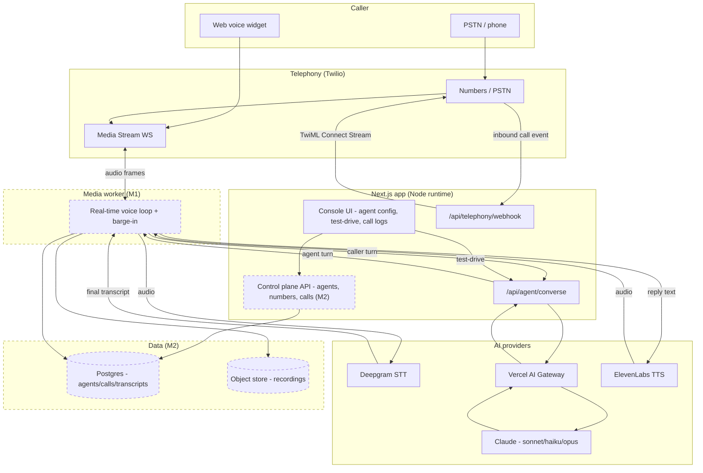
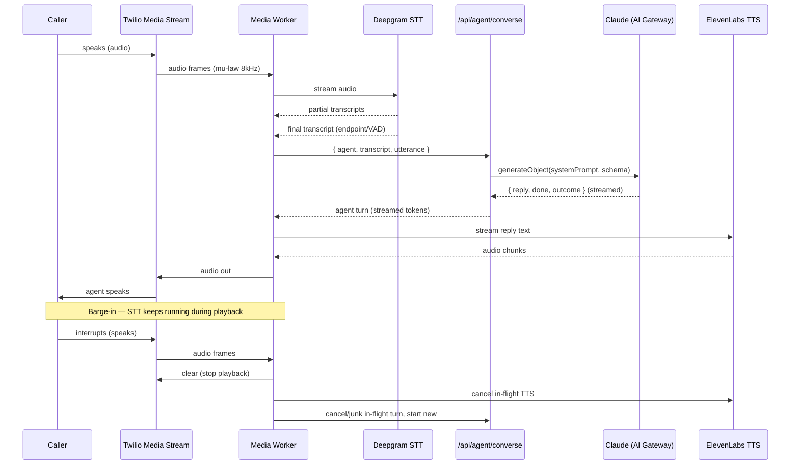
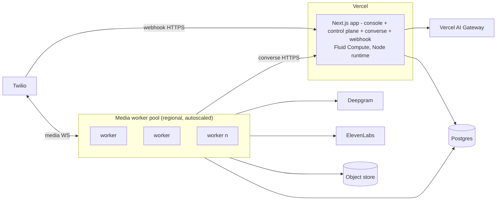

# Architecture — AI Voice Agent

## System diagram

Dashed nodes (media worker, control plane, persistence) are the M1–M2 build-out;
the solid path (console → `converse`, telephony webhook, AI Gateway) is
implemented in this scaffold and runs today, with mock fallback when no keys are
present.

## Real-time voice loop (per turn)

## Request lifecycle of a call

1. **Ring.** Caller dials a Twilio number. Twilio POSTs a voice webhook to
   `/api/telephony/webhook` (form-encoded).
2. **Answer & consent.** The webhook validates the payload, decides the action,
   and returns TwiML: `<Say>` plays the recording-consent notice, then
   `<Connect><Stream>` points Twilio at the media-stream WebSocket
   (`wss://<host>/api/telephony/media`). A safe fallback (`<Hangup/>`) is
   returned for non-new-call statuses.
3. **Media stream.** Twilio opens the WebSocket to the media worker and streams
   caller audio. The worker feeds audio to Deepgram for streaming STT.
4. **Turn.** On a final/endpointed caller utterance, the worker calls
   `/api/agent/converse` with the agent config, transcript so far, and the new
   utterance. `converse` builds the persona system prompt and calls Claude via
   the AI Gateway (`generateObject`), returning typed `{ reply, done, outcome }`.
   On model error it returns a safe mock turn (never drops the call).
5. **Speak.** The worker streams the reply text to ElevenLabs and pipes audio
   back to Twilio. Streaming both directions keeps first-audio latency low.
6. **Barge-in.** STT runs throughout; if the caller interrupts, playback is
   cleared, in-flight TTS/LLM are cancelled, and a new turn begins.
7. **Loop / escalate.** Repeat until `done`, `maxTurns`, or an escalation
   trigger — then warm-transfer (`<Dial>` the transfer number) or wrap up.
8. **Finalize.** On hangup, the worker persists the transcript, runs the
   summarization/outcome pass, writes billable duration and cost, and stores the
   recording (if consent permits).

## Deployment topology

- **Next.js app** deploys to Vercel (Fluid Compute, Node runtime — avoids
  edge-only APIs so telephony/media SDKs work). Stateless and horizontally
  scalable.
- **Media workers** are the stateful piece (one WebSocket + audio pipeline per
  live call). Deployed as a regional autoscaled pool (containers) close to
  Twilio/provider regions to minimize latency; graceful connection drain on
  deploy. In the scaffold, the converse path is exercised directly from the
  console.
- **Providers** (Twilio, Deepgram, ElevenLabs) reached over the network; model
  calls go through the AI Gateway. Each provider is behind an interface for
  failover.
- **Data** in Postgres (agents/calls/transcripts) and object storage
  (recordings), added in M2.

## Environment / config notes

Full documentation in [`.env.example`](../.env.example). Key variables:

- **`AI_GATEWAY_API_KEY`** (or `ANTHROPIC_API_KEY`) — enables live model replies;
  absent ⇒ demo mode with mock turns (`hasAI()` gate in `lib/ai.ts`).
- **`TWILIO_ACCOUNT_SID` / `TWILIO_AUTH_TOKEN` / `TWILIO_API_KEY` /
  `TWILIO_API_SECRET` / `TWILIO_PHONE_NUMBER`** — telephony; auth token also used
  to verify inbound webhook signatures.
- **`DEEPGRAM_API_KEY`** — streaming STT.
- **`ELEVENLABS_API_KEY` / `ELEVENLABS_DEFAULT_VOICE_ID`** — streaming TTS.
- **`PUBLIC_BASE_URL`** — public URL of the deployment; used to construct the
  webhook and `wss://` media-stream URLs returned to Twilio. In local dev, set
  this to an ngrok/tunnel URL so Twilio can reach your machine.
- **`TWO_PARTY_CONSENT_REGIONS`** — regions requiring affirmative recording
  consent; drives consent-notice/recording behavior.
- **`DATABASE_URL`** — Postgres (M2; optional for the scaffold).

Runtime: all API routes declare `export const runtime = "nodejs"`. Secrets are
provided via `.env.local` (never committed); provider keys should be
least-privilege and rotated.
