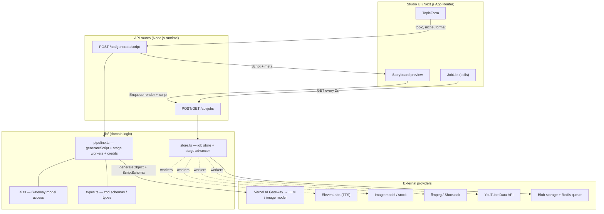
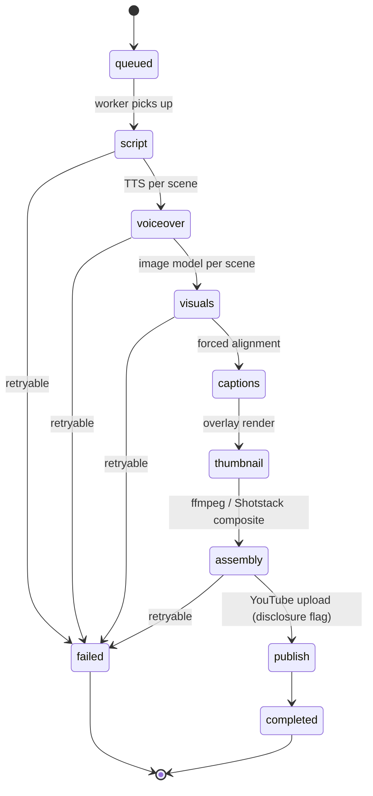

# Architecture — Faceless AI YouTube Generation

## System & pipeline diagram

## Async job flow (stage pipeline)

## Data flow

1. **Topic → Script (synchronous).** `TopicForm` POSTs `{topic, niche, format, aspectRatio,
   targetLengthSec}` to `/api/generate/script`. The route validates with zod and calls
   `generateScript`, which runs `generateObject` (schema `ScriptSchema`) through the AI Gateway —
   or returns `mockScript` when `hasAI()` is false. The typed `Script` + `meta` (scene count,
   duration, estimated credits) returns to the client and renders as the `Storyboard`.
2. **Script → Job (enqueue).** The user clicks *Enqueue render*; the client POSTs the previewed
   `Script` to `/api/jobs`. The route builds a `VideoJob` with `initialStages()` (script marked
   done since it was pre-generated), computes `estimatedCredits`, and stores it.
3. **Job → Stages (async).** Background workers execute each stage, writing `Asset`s to blob
   storage and advancing `StageStatus`. In the scaffold, `store.ts::advance()` simulates this by
   fast-forwarding stages against wall-clock time since `createdAt` — a pure, idempotent function
   so every `GET /api/jobs` poll is consistent.
4. **Status → UI.** `JobList` polls `GET /api/jobs` every 2s and renders per-stage dots, progress,
   consumed vs. estimated credits, and the published YouTube id on completion.

## Lifecycle of a video job

`queued` → (worker claims) → `script` (reused if pre-generated) → `voiceover` (per-scene audio) →
`visuals` (per-scene images) → `captions` (aligned) → `thumbnail` → `assembly` (final file) →
`publish` (optional YouTube upload with AI-disclosure) → `completed`. Any stage may enter
`failed` and be retried independently; completed upstream assets are reused so retries never
re-bill work. `consumedCredits` grows with completed stages; on completion it equals
`estimatedCredits` and `youtubeVideoId` is set.

## Deployment topology

- **Front-end + API routes:** Vercel (Next.js App Router), Node.js runtime / Fluid Compute — no
  edge-only APIs so media/TTS SDKs and ffmpeg shell-outs work.
- **Workers:** long-running stages (visuals, assembly) run on Fluid Compute or dedicated render
  nodes, pulling from a Redis-backed queue; cloud render can offload to Shotstack for burst.
- **State:** Postgres for jobs/projects/voice profiles; Redis for the queue; blob storage for
  assets (signed, expiring URLs).
- **Scaffold mode:** everything runs in-process — in-memory job store + time-based stage
  simulator — so `pnpm dev` boots the full flow with zero external services.

## Environment / config

Config is entirely env-driven (see `.env.example`). With **no** keys the app runs in mock mode:
`hasAI()`, `hasTTS()`, `hasImageGen()` return false and each stage yields realistic placeholders.

- `AI_GATEWAY_API_KEY` / `ANTHROPIC_API_KEY` — LLM + image routing (script generation).
- `ELEVENLABS_API_KEY`, `ELEVENLABS_DEFAULT_VOICE_ID` — voiceover.
- `IMAGE_PROVIDER_API_KEY`, `FAL_API_KEY` — B-roll images.
- `SHOTSTACK_API_KEY`, `SHOTSTACK_ENV`, `FFMPEG_PATH` — assembly.
- `YOUTUBE_CLIENT_ID/SECRET`, `YOUTUBE_REDIRECT_URI`, `YOUTUBE_REFRESH_TOKEN` — publishing.
- `BLOB_READ_WRITE_TOKEN`, `REDIS_URL` — asset storage + job queue.
- `NEXT_PUBLIC_APP_URL` — absolute URLs / OAuth redirects.
