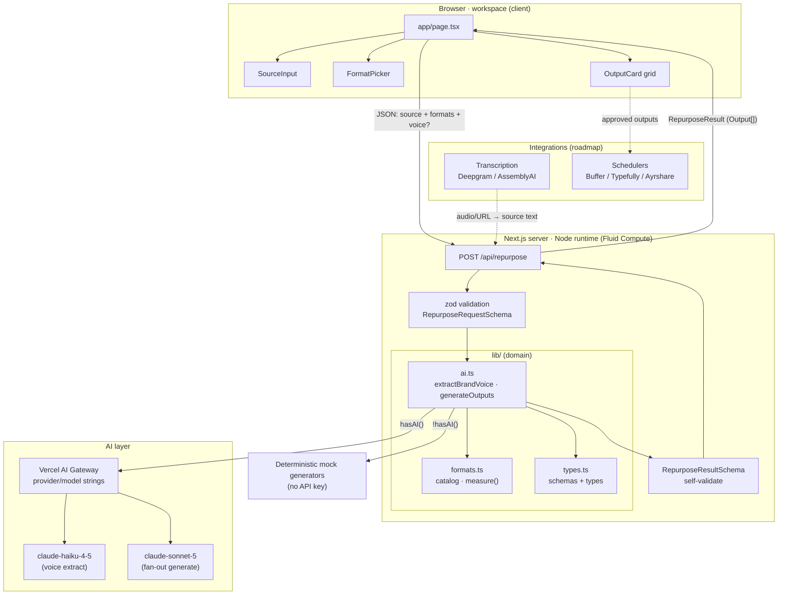

# Architecture — AI Content Repurposing

## System diagram



## Data flow

`source → analyze voice → fan-out generate → measure/review → (schedule)`

1. **Capture** — the workspace collects source text, source kind, and selected formats (optional
   brand-voice override). Client enforces a minimum length and non-empty selection before enabling the
   run button.
2. **Request** — `POST /api/repurpose` with `RepurposeRequest`; the route validates it against
   `RepurposeRequestSchema` (422 on failure).
3. **Analyze voice** — `extractBrandVoice()` returns a `BrandVoice`. If the caller supplied a rich
   voice it's used directly; otherwise a fast-model `generateObject` extracts a fingerprint from the
   source (or a mock voice with no key). Caller overrides are merged on top.
4. **Fan-out generate** — `generateOutputs()` issues one `generateObject` call with `output:"array"`;
   the element schema yields one typed asset per requested format. The system prompt encodes the brand
   voice; the user prompt injects each format's native instruction plus the (truncated) source.
5. **Measure / review** — each element is enriched with platform, label, `charCount`, and `overLimit`
   (`measure()`); missing formats are backfilled. The result is validated against
   `RepurposeResultSchema` before sending.
6. **Render** — the UI renders an `OutputCard` per asset with segmented/prose body, hashtags, live
   char count vs. limit, over-limit badge, and copy button. Users copy into their channels.
7. **Schedule (roadmap)** — approved outputs are pushed to a scheduler; source ingestion can be fed by
   transcription of audio/video URLs.

## Request lifecycle

```
Client run()
  → fetch POST /api/repurpose { source, kind, formats }
    → parse JSON            (400 on bad JSON)
    → RepurposeRequestSchema.safeParse  (422 on invalid)
    → extractBrandVoice()   (fast model | mock)
    → generateOutputs()     (smart model, array output | mock)
        → enrich + backfill + measure()
    → RepurposeResultSchema.parse
  ← 200 RepurposeResult     (500 on thrown error)
Client setResult() → OutputCard grid renders
```

Timing (`elapsedMs`), `usedAI`, `model`, and source `wordCount` ride along in the response for the
time-saved KPI and the live/mock UI badge.

## Deployment topology

- **Platform:** Vercel. Next.js 15 App Router; API route on the Node.js runtime (Fluid Compute) with
  `maxDuration=60`. No edge-only dependencies.
- **AI:** all model calls leave through the Vercel AI Gateway via `"provider/model"` strings — no
  provider SDK bundled. Gateway supplies routing, failover, and token/cost/latency observability.
- **Stateless:** the scaffold persists nothing; horizontally scalable. Production layers add auth,
  rate limiting, per-tenant usage metering (drives volume billing), and optionally a durable queue for
  agency-scale batch jobs.
- **Monorepo:** pnpm workspace package `@mmai/ai-content-repurposing`; shares the portfolio's
  conventions (TS strict, Tailwind, AI SDK v5).

## Environment / configuration

Configured via `.env.local` (see `.env.example`):

| Variable | Purpose | Required |
| --- | --- | --- |
| `AI_GATEWAY_API_KEY` | Live model access via AI Gateway | For live mode (else mock) |
| `ANTHROPIC_API_KEY` | Alternate direct provider path | Optional |
| `BUFFER_ACCESS_TOKEN` | Scheduler push (roadmap) | Optional |
| `TYPEFULLY_API_KEY` | X-thread scheduling (roadmap) | Optional |
| `AYRSHARE_API_KEY` | Multi-network posting (roadmap) | Optional |
| `DEEPGRAM_API_KEY` / `ASSEMBLYAI_API_KEY` | Source transcription (roadmap) | Optional |
| `NEXT_PUBLIC_APP_URL` | Public base URL for links/callbacks | Optional |

`hasAI()` gates live vs. mock: true when `AI_GATEWAY_API_KEY` or `ANTHROPIC_API_KEY` is set. With no
keys, every path returns deterministic mock content so the app runs end-to-end offline. Model choices
and the format catalog (labels, platform limits, native instructions) are centralized in `lib/ai.ts`
and `lib/formats.ts` respectively, so tuning behavior needs no changes to routes or components.
