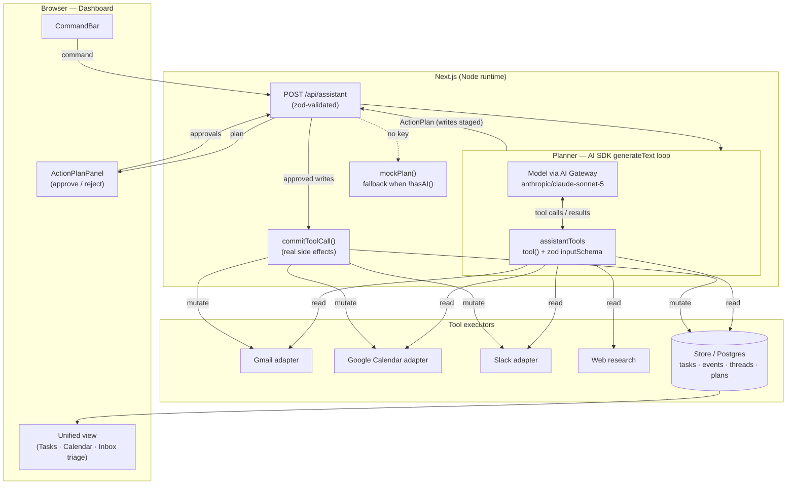
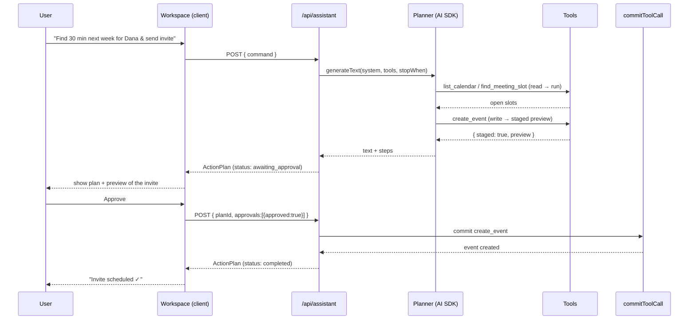

# Architecture — Aide (AI Virtual Assistant)

## System diagram (agent + tools loop)

## Data flow

1. **Hydrate.** `app/page.tsx` (Server Component) calls `getDashboardData()` and
   passes today's tasks, events, and triaged threads to the client workspace.
2. **Command.** The user types a command; `AssistantWorkspace` POSTs it to
   `/api/assistant`.
3. **Plan.** The route validates input, then either runs the AI planner
   (`generateText` + `assistantTools` + `stopWhen: stepCountIs(8)`) or the mock
   planner. Read tools execute against the store/integrations during the loop;
   write tools return a staged preview.
4. **Assemble.** Tool calls across all steps are flattened into a typed
   `ActionPlan`; write steps are marked `awaiting_approval`. The plan is cached
   by `planId`.
5. **Review.** `ActionPlanPanel` renders each step with its status and previews;
   the user approves/rejects the staged writes.
6. **Commit.** A second request (`approvals` + `planId`) runs `commitToolCall()`
   for approved steps — the only place real side effects fire — then recomputes
   and returns the updated plan.

## Lifecycle of a command

## Deployment topology

- **Platform:** Vercel. Next.js App Router; API routes on the Node.js runtime
  (Fluid Compute) so integration SDKs (Gmail/Calendar/Slack) run server-side.
- **Model access:** Vercel AI Gateway via `"provider/model"` strings; a single
  `AI_GATEWAY_API_KEY` fronts all providers and centralizes cost/rate limits.
- **State:** scaffold uses a process-local store + plan cache. Production adds
  managed Postgres (users, tasks, events, threads, plans, audit log) and
  Redis/Upstash for the short-lived plan cache; OAuth tokens in an encrypted
  store.
- **Background work (roadmap):** cron-triggered proactive triage ("morning
  brief") and long research runs via a queue, separate from the request path.
- **Scale:** stateless functions scale horizontally; per-tenant quotas back the
  usage tiers.

## Environment / config

Configured entirely via env (`.env.example` → `.env.local`); the app boots with
none set (mock mode):

| Variable | Purpose |
| --- | --- |
| `AI_GATEWAY_API_KEY` | Model access via Vercel AI Gateway. Absent → mock planner. |
| `ANTHROPIC_API_KEY` | Optional direct provider key (alt to the Gateway). |
| `GOOGLE_CLIENT_ID` / `GOOGLE_CLIENT_SECRET` / `GOOGLE_REDIRECT_URI` | Gmail + Calendar OAuth. |
| `SLACK_CLIENT_ID` / `SLACK_CLIENT_SECRET` / `SLACK_SIGNING_SECRET` / `SLACK_BOT_TOKEN` | Slack app. |
| `APP_BASE_URL` | Base URL for OAuth redirects and links. |

Model routing lives in `lib/ai.ts` (`MODELS`, `PLANNER_MODEL`); tool metadata
and gating live in `lib/tools.ts` (`TOOL_META`); autonomy defaults live on the
user's `preferences`. Changing the planner model or gating policy is a one-line
edit in those files.
