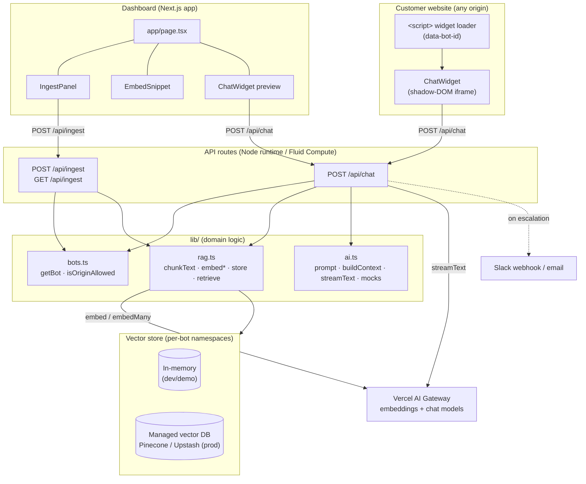
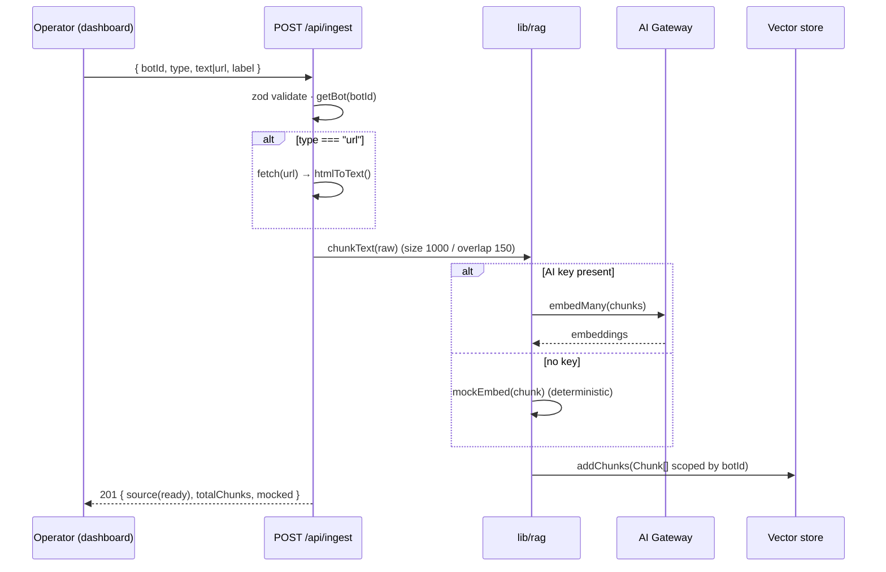
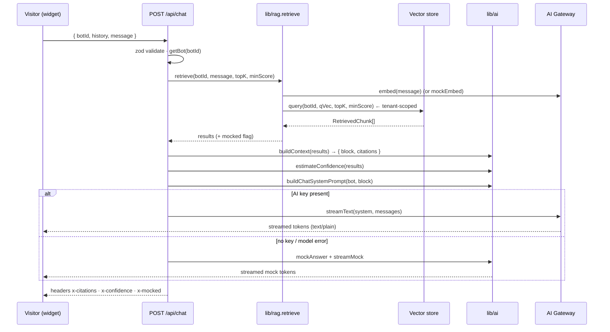

# Architecture — AI Chatbot Agent

## System diagram

## Ingestion data flow

## RAG query (request) lifecycle

## Data-flow description

1. **Author time (ingestion):** an operator submits text or a URL from the dashboard. The ingest
   route validates the payload, resolves the tenant (`getBot`), extracts readable text (HTML → text
   for URLs), chunks it with overlap, embeds each chunk (real or mock), and writes `Chunk` records —
   each stamped with `botId` — into the vector store. Per-source status (`queued → crawling →
   embedding → ready|failed`) is tracked for the dashboard.
2. **Query time (chat):** the widget posts the conversation history plus the new message. The chat
   route embeds the question, runs a `botId`-scoped cosine top-k query, builds a numbered context
   block and the parallel `Citation[]`, composes a grounding system prompt, and streams the answer
   via `streamText`. Citations and a confidence score travel back in response headers; the widget
   renders tokens as they arrive and shows citation chips when the stream ends.
3. **Escalation (roadmap live):** low confidence, an explicit request, or detected frustration marks
   the conversation `handoff_requested` and posts the transcript to Slack/email.

## Request lifecycle (per HTTP call)

- Enters a stateless Next.js Route Handler on the Node.js runtime (Fluid Compute).
- `zod` validates the body; malformed input returns typed `4xx` JSON.
- Tenant resolution via `getBot`; unknown bots `404`.
- Core work (embed/retrieve/stream) delegated to `lib/`.
- Response: JSON for ingest; a streamed `text/plain` body + metadata headers for chat.
- Failures in the model/embedding layer degrade to mock rather than surfacing an error to the widget.

## Deployment topology

- **Platform:** Vercel. The Next.js app serves the dashboard (static/SSR) and the API routes as
  serverless functions on **Fluid Compute** (Node.js runtime; needed for URL fetching and streaming).
- **Statelessness:** routes hold no session state and scale horizontally.
- **Stateful tier:** the vector store. In dev/demo it is an in-memory singleton pinned to
  `globalThis` (survives hot reload, non-durable). In production it is an external managed vector DB
  (Pinecone/Upstash) behind the same `VectorStore` interface, one namespace per bot. Bots/
  conversations/leads move to Postgres.
- **Widget delivery (roadmap):** a small `/widget.js` loader served from the app origin mounts the
  chat UI in a shadow-DOM iframe on customer sites; it only calls allow-listed API routes.
- **Streaming:** `streamText().toTextStreamResponse()` streams tokens over a standard HTTP response;
  no websockets required.

## Environment / configuration

| Variable | Purpose | Default / fallback |
|----------|---------|--------------------|
| `AI_GATEWAY_API_KEY` | Gateway key for embeddings + chat | unset → mock embeddings & mock streamed answers |
| `ANTHROPIC_API_KEY` | Alternative provider key detected by `hasAI()` | unset |
| `CHAT_MODEL` | Chat model string | `anthropic/claude-sonnet-5` |
| `EMBEDDING_MODEL` | Embedding model string | `openai/text-embedding-3-small` |
| `VECTOR_DB` | Store backend selector | `memory` |
| `PINECONE_API_KEY` / `PINECONE_INDEX` | Pinecone adapter (prod) | unset |
| `UPSTASH_VECTOR_REST_URL` / `_TOKEN` | Upstash Vector adapter (prod) | unset |
| `SLACK_WEBHOOK_URL` | Human-handoff notifications | unset |
| `HANDOFF_EMAIL` | Handoff email recipient | unset |
| `WIDGET_ALLOWED_ORIGINS` | CORS allow-list for the widget | `*` (demo) |

Config principle: the app must boot and demonstrate the full RAG loop with **no** environment
variables set. Keys and DB endpoints are progressive enhancements, not prerequisites.
