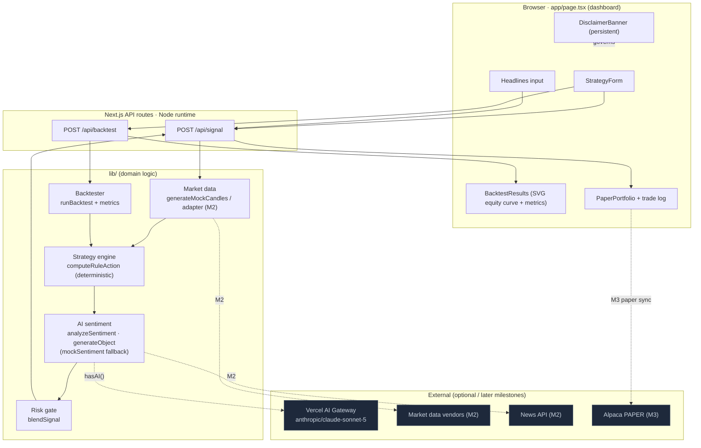

# Architecture — AI Trading Bot (Research Sandbox)

> Research/education tool. Output is hypothetical and not financial advice. Execution is paper
> (simulated) by default; live is gated and opt-in.

## System diagram



## Data flow

1. **Strategy in.** The user configures a `Strategy` (rule, windows, sizing, risk limits, sentiment
   weight) in `StrategyForm` and optionally edits the news `headlines`.
2. **Market data.** `POST /api/signal` uses the supplied snapshot or synthesizes a deterministic
   OHLC series (`generateMockCandles`). `POST /api/backtest` uses supplied candles or a seeded
   synthetic series. (M2 swaps in a real market-data adapter.)
3. **Rules (deterministic).** `computeRuleAction` derives a `{action, strength}` from indicators
   (SMA / RSI / momentum / breakout) using only data up to the current bar (no look-ahead).
4. **AI sentiment (advisory).** `analyzeSentiment` calls `generateObject` with the `Sentiment` zod
   schema over the headlines (or `mockSentiment` when `!hasAI()` or on error). Returns
   `score ∈ [-1,1]`, `label`, `rationale`, `drivers`.
5. **Risk gate (decides).** `blendSignal` blends rule strength with weighted sentiment agreement into
   a `confidence`, then applies the gate: min-confidence, strong-contradiction downgrade to `hold`,
   and portfolio drawdown halt. Emits `action`, `riskBlocked`, `riskNotes`, and a composed
   `rationale`.
6. **Execution (paper).** The dashboard steps an executed signal into a simulated portfolio
   (`applyPaperTrade`): sizing, friction, positions, realized/unrealized P&L, trade log. (M3 adds
   server-side Alpaca **paper** sync.)
7. **Reporting.** `BacktestResults` renders the equity curve (inline SVG) + research metrics;
   `PaperPortfolio` shows the latest signal, positions, and trade log. The `DisclaimerBanner` is
   always visible.

## Lifecycle of a signal

```
Strategy + snapshot + headlines
        │
        ▼
computeRuleAction ──► ruleAction, strength        (pure, deterministic)
        │
        ▼
analyzeSentiment / mockSentiment ──► Sentiment     (AI advisory; graceful fallback)
        │
        ▼
blendSignal:
   confidence = ruleStrength·(1−w) + max(0, ruleStrength + agreement)·w
   gate: contradiction downgrade → min-confidence → drawdown halt
        │
        ▼
Signal { action, ruleAction, confidence, sentiment, rationale, riskBlocked, riskNotes }
        │
        ▼
(paper) applyPaperTrade → Portfolio + Trade   |   response includes disclaimer
```

Key invariant: **rules lead, AI advises, risk decides.** Sentiment can reinforce/damp confidence and
downgrade an action to `hold`, but can never, by itself, create a trade from a `hold`.

## Deployment topology

- **Platform:** Vercel. Next.js 15 App Router; API route handlers on the **Node.js runtime** (Fluid
  Compute) — no edge-only APIs. Stateless, horizontally scalable.
- **Static/UI:** React Server Components by default; `"use client"` only for the interactive
  dashboard/form/results.
- **Secrets:** environment variables on the server only (AI Gateway, market-data, Alpaca paper).
  Never shipped to the client.
- **Later milestones:** Postgres for saved strategies/users (M2), a queue/worker for parameter
  sweeps + scheduled runs (M2/M3), append-only audit log for any live routing (M5).

## Environment / config

| Variable | Purpose | Default behavior if unset |
|----------|---------|---------------------------|
| `AI_GATEWAY_API_KEY` | Vercel AI Gateway (primary) | Sentiment uses deterministic mock |
| `ANTHROPIC_API_KEY` | Direct Anthropic fallback | Same as above |
| `ALPHAVANTAGE_API_KEY` / `POLYGON_API_KEY` / `FINNHUB_API_KEY` | Market data (M2) | Synthetic OHLC |
| `NEWSAPI_API_KEY` | News/sentiment source (M2) | User-pasted headlines / none |
| `ALPACA_API_KEY_ID` / `ALPACA_API_SECRET_KEY` / `ALPACA_BASE_URL` | Alpaca **paper** (M3) | In-app simulated paper only |
| `ENABLE_LIVE_TRADING` | Safety switch for live routing | Paper-only (default) |

`hasAI()` is true when either AI key is present; otherwise every path degrades gracefully so the full
demo runs with zero configuration. Backtests are always deterministic for a given `{strategy, seed,
bars}`.
