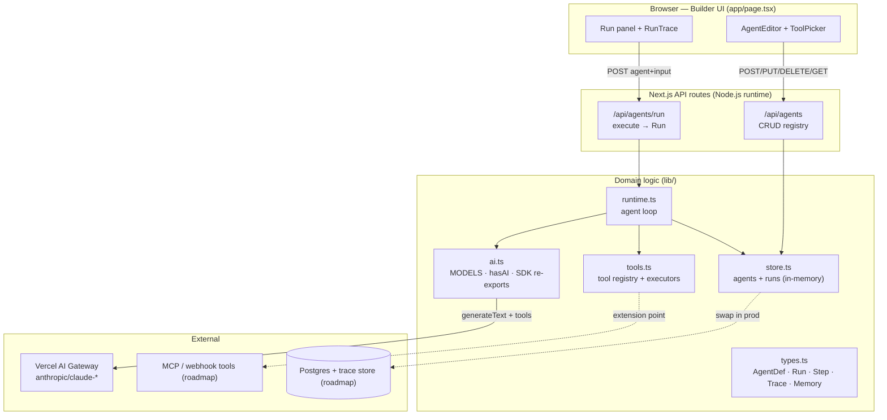

# Architecture — Agent Forge

## System diagram



## Agent runtime + tool loop + trace pipeline

```mermaid
sequenceDiagram
  autonumber
  participant UI as Builder UI
  participant API as /api/agents/run
  participant RT as runtime.runAgent
  participant AI as AI SDK (generateText)
  participant GW as AI Gateway (model)
  participant TL as Tool executor
  participant TR as Trace collector

  UI->>API: POST { agent | agentId, input, history }
  API->>API: zod validate → resolve AgentDef
  API->>RT: runAgent(agent, input, history)
  RT->>TR: emit run_start
  alt hasAI() == true
    RT->>AI: generateText(model, system, prompt, tools, stopWhen=stepCountIs(maxSteps))
    loop until final answer or maxSteps
      AI->>GW: model turn (may request tool calls)
      GW-->>AI: tool calls / text
      AI->>TL: execute(toolInput)   %% instrumented
      TL->>TR: ToolSpan (input, output, ok, latency)
      TL-->>AI: tool result
    end
    AI-->>RT: { text, steps, usage }
    RT->>RT: map steps → Step[]; correlate spans
  else no key (mock loop)
    RT->>RT: plan tool calls from input
    RT->>TL: run real mock executors
    TL->>TR: ToolSpan (measured)
    RT->>RT: compose final answer
  end
  RT->>TR: emit model_step + tool_call spans + run_end
  RT-->>API: Run { steps, trace, usage, output, status }
  API->>API: saveRun(run)
  API-->>UI: { run, hasAI }
  UI->>UI: render final answer + timeline + step cards
```

## Data flow

1. **Define** — the builder holds an `AgentDraft`; saving it POSTs/PUTs to `/api/agents`, which
   validates and persists an `AgentDef` in the store (scoped by `orgId`).
2. **Run** — the run panel POSTs the live draft (or an `agentId`) + input to `/api/agents/run`. The
   route resolves an `AgentDef` and calls `runAgent`.
3. **Loop** — `runtime` builds the tool set for the agent's `toolIds`, then either drives the AI SDK
   tool-calling loop or the deterministic mock loop. Each tool execution emits a measured `ToolSpan`.
4. **Trace** — spans + model steps are assembled into an ordered `Trace`; the full `Run` (steps,
   trace, usage, output) is persisted and returned.
5. **Observe** — the UI renders the final answer, the trace timeline (span bars with latency), and
   per-step tool cards (input/output/error).

## Run lifecycle

`running → completed` on success (final answer produced within `maxSteps`), or `running → failed` if
the model call throws (a partial trace + `error` are still returned; tool-level errors are captured
into the step's `ToolInvocation.error` and do **not** fail the run).

## Deployment topology

- **Platform:** Next.js on Vercel. UI as Server/Client Components; API routes as Node.js Functions
  (Fluid Compute) — chosen so the agent loop and tool executors have full Node APIs and a longer
  wall-clock budget (`maxDuration = 60s`).
- **Model access:** all model calls egress through the Vercel AI Gateway via `provider/model` strings;
  no provider SDK is bundled. Gateway provides spend caps and failover.
- **State:** v1 in-memory store (warm-process lifetime). Production: Postgres for agents + runs behind
  the same `store.ts` interface, plus a dedicated trace backend with tiered retention.
- **Tenancy:** single control plane; every entity + run carries `orgId`; usage metered per org for
  billing. Untrusted tool execution isolates into out-of-process / microVM sandboxes.

## Environment / config

| Variable | Required | Purpose |
| --- | --- | --- |
| `AI_GATEWAY_API_KEY` | for live runs | Routes `provider/model` calls through the AI Gateway. Absent → deterministic mock loop (full trace, canned outputs). |
| `ANTHROPIC_API_KEY` | optional | Accepted as an alternative "AI available" signal; prefer the gateway key. |

- Model tiers are configured in `lib/ai.ts` (`MODELS`) and selected per agent via `AgentDef.model`.
- Loop/cost bounds are enforced by zod (prompt ≤ 20k, input ≤ 8k, `maxSteps` ≤ 25).
- No secrets in agent definitions or traces; keys via environment only.
