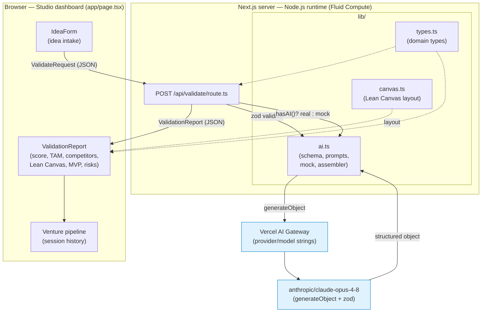

# Architecture — AI Venture Studio

## System diagram



## Data flow: idea → validate → canvas → MVP spec → landing

1. **Idea intake.** `IdeaForm` collects `title`, `description`, optional
   `market` and `businessModel`, and emits a typed `ValidateRequest`.
2. **Validate.** `page.tsx` POSTs to `/api/validate`. The route zod-validates
   the body, then either calls `generateObject` (real) or `mockValidation`
   (no key / on error). One structured pass produces the market analysis,
   competitor scan, customer segments, Lean Canvas, MVP spec, risks, and
   landing copy — all constrained by `validationSchema`.
3. **Canvas.** The generated `LeanCanvas` is rendered by `LeanCanvasGrid` via
   `toRenderableCanvas`, which maps the nine blocks onto the canonical 5×3 grid.
4. **MVP spec.** `ValidationReport` renders the MVP as a MoSCoW-prioritized
   checklist with effort estimates and user stories.
5. **Landing.** The generated landing copy renders as a preview hero block —
   the artifact a founder uses to test demand next.
6. **Pipeline.** Each completed report is appended to the session venture
   pipeline (title, score, recommendation) so an operator can compare ventures.

## Request lifecycle

```
Browser fetch POST /api/validate
  → parse JSON            (400 on malformed)
  → zod bodySchema        (422 on invalid, with field errors)
  → ideaId = randomUUID()
  → hasAI() ?
       no  → mockValidation(input)                    (deterministic, seeded)
       yes → generateObject(frontier, schema, prompts, temp 0.6)
               success → assembleReport(...)
               throw   → mockValidation + x-fallback-reason header
  → 200 ValidationReport (JSON)
Browser → setReport + append to pipeline → render report view
```

The route is stateless: every request is self-contained, so it scales
horizontally and has no shared mutable state to coordinate.

## Deployment topology

- **Platform:** Vercel. Next.js App Router; the API route runs on the Node.js
  runtime under Fluid Compute (no edge-only APIs). `maxDuration = 60s` covers a
  full frontier-model multi-section generation.
- **Static/UI:** the dashboard is a client component served with the app bundle.
- **AI:** all model traffic egresses through the Vercel AI Gateway via
  `"provider/model"` strings — no provider SDK, no client-side keys.
- **Statelessness:** v1 stores nothing server-side; the venture pipeline is
  in-memory per session. Persistence (Postgres/Blob) is a roadmap add that would
  sit behind the route without changing the client contract.

## Environment & config

| Variable             | Required | Purpose                                             |
| -------------------- | -------- | --------------------------------------------------- |
| `AI_GATEWAY_API_KEY` | No\*     | Vercel AI Gateway key for real generation.          |
| `ANTHROPIC_API_KEY`  | No\*     | Alternative direct provider key.                    |
| `MARKET_DATA_API_KEY`| No       | Roadmap: grounded TAM/market sizing.                |
| `ANALYTICS_WRITE_KEY`| No       | Roadmap: funnel + throughput analytics.             |

\* `hasAI()` returns true if either AI key is set. With neither, the route serves
deterministic mock reports so the full flow works with zero configuration.

Config lives entirely in environment variables (`.env.example` → `.env.local`);
no secrets are committed. Model selection is centralized in `MODELS`
(`lib/ai.ts`) — switch the default tier there to trade quality for cost/latency.
