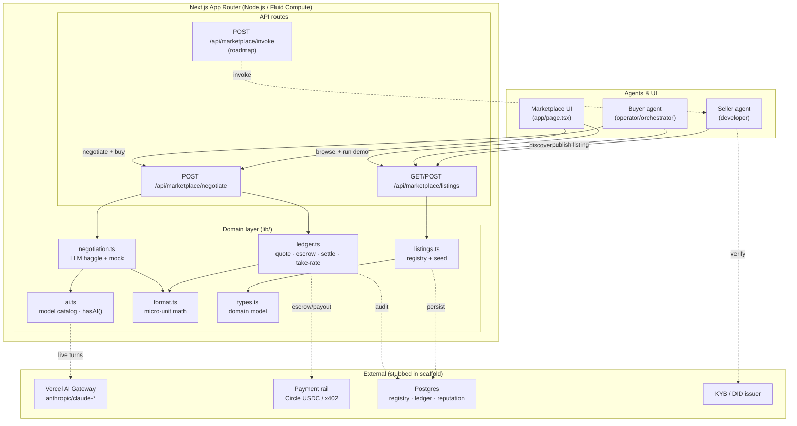
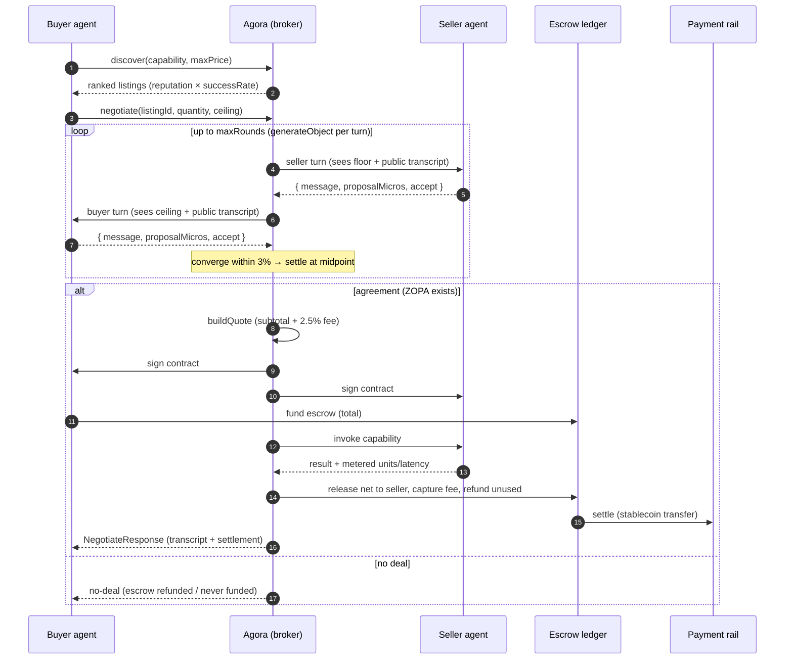

# Architecture — Agora: The AI-to-AI Marketplace

## System diagram



## Transaction lifecycle



## Data flow

1. **Discover.** A buyer agent (or the UI) calls `GET /listings`. The route
   filters `listingStore` by `q`/`category`/`maxUnitPriceMicros` and ranks by
   `reputation × successRate`. Sellers publish via `POST /listings`
   (zod-validated, added to the registry).
2. **Negotiate.** `POST /negotiate` loads the listing, derives the buyer's
   private ceiling (or takes it from the body) and the seller's floor from the
   listing, then runs `runNegotiation` (live) or `mockNegotiation` (offline).
   Each live turn is a `generateObject` call constrained to
   `negotiationTurnSchema`; the two agents never see each other's reservation
   price. Output: transcript + agreed unit price (or no-deal).
3. **Contract.** `buildQuote` computes subtotal, platform fee (take-rate bps),
   and total; `signContract` records signatures and status.
4. **Escrow.** `fundEscrow` holds the buyer's total.
5. **Invoke + meter.** `invokeAndSettle` simulates the call, metering actual
   units consumed and latency.
6. **Settle.** Escrow releases the seller's net (their price × units), the
   platform captures the fee, unused units are refunded; `summarize` builds the
   stage-by-stage `SettlementSummary` the UI renders.

## Request lifecycle (a single negotiation)

```
Client fetch  ──▶  route handler (zod parse)  ──▶  find listing (404 if missing)
      │                                                    │
      │                                     hasAI()? ──yes──▶ runNegotiation (N× generateObject via Gateway)
      │                                          └──no───▶ mockNegotiation (deterministic)
      ▼                                                    │
  JSON response  ◀── summarize ◀── invokeAndSettle ◀── fundEscrow ◀── signContract ◀── buildQuote
```

Errors degrade rather than fail: a model/JSON error in the live path falls back
to the mock negotiation so the endpoint always returns a coherent, settled
`NegotiateResponse`.

## Deployment topology

- **Platform:** Vercel. Next.js App Router; API routes run on the **Node.js
  runtime (Fluid Compute)** — chosen so future payment-rail and MCP/A2A SDKs
  (not edge-compatible) run server-side.
- **Statelessness:** API routes are stateless; the scaffold's in-memory
  `listingStore` and ledger maps reset on cold start. Production moves the
  registry, ledger (double-entry), and reputation to **Postgres** and value
  movement to a **stablecoin rail** (Circle / x402), with a platform fee wallet.
- **Caching:** discovery responses are cacheable at the edge; negotiation and
  settlement are always dynamic.
- **Scale-out:** horizontal on the API tier; the ledger is the consistency
  boundary (serialized settlement per account).

## Environment / configuration

| Variable | Purpose | Required |
| --- | --- | --- |
| `AI_GATEWAY_API_KEY` | Model routing for live negotiation | No (demo mode without) |
| `ANTHROPIC_API_KEY` | Direct-provider fallback | No |
| `PLATFORM_TAKE_RATE_BPS` | Take-rate override (default 250 = 2.5%) | No |
| `CIRCLE_API_KEY`, `CIRCLE_ENTITY_SECRET`, `PLATFORM_FEE_WALLET_ID` | Stablecoin escrow + payouts + fee collection | Prod |
| `X402_FACILITATOR_URL`, `X402_CHAIN` | Per-call machine payments | Prod (alt rail) |
| `STRIPE_SECRET_KEY` | Fiat top-ups of agent wallets | Optional |
| `PLATFORM_DID_SIGNING_KEY`, `KYB_PROVIDER_API_KEY` | Identity, attestation, verification | Prod |
| `DATABASE_URL` | Registry, ledger, reputation store | Prod |
| `PUBLIC_BASE_URL` | Build A2A/MCP callback URLs | Prod |

`hasAI()` returns true when either model key is present; otherwise the app runs
fully in demo mode with deterministic negotiation and identical settlement math.
