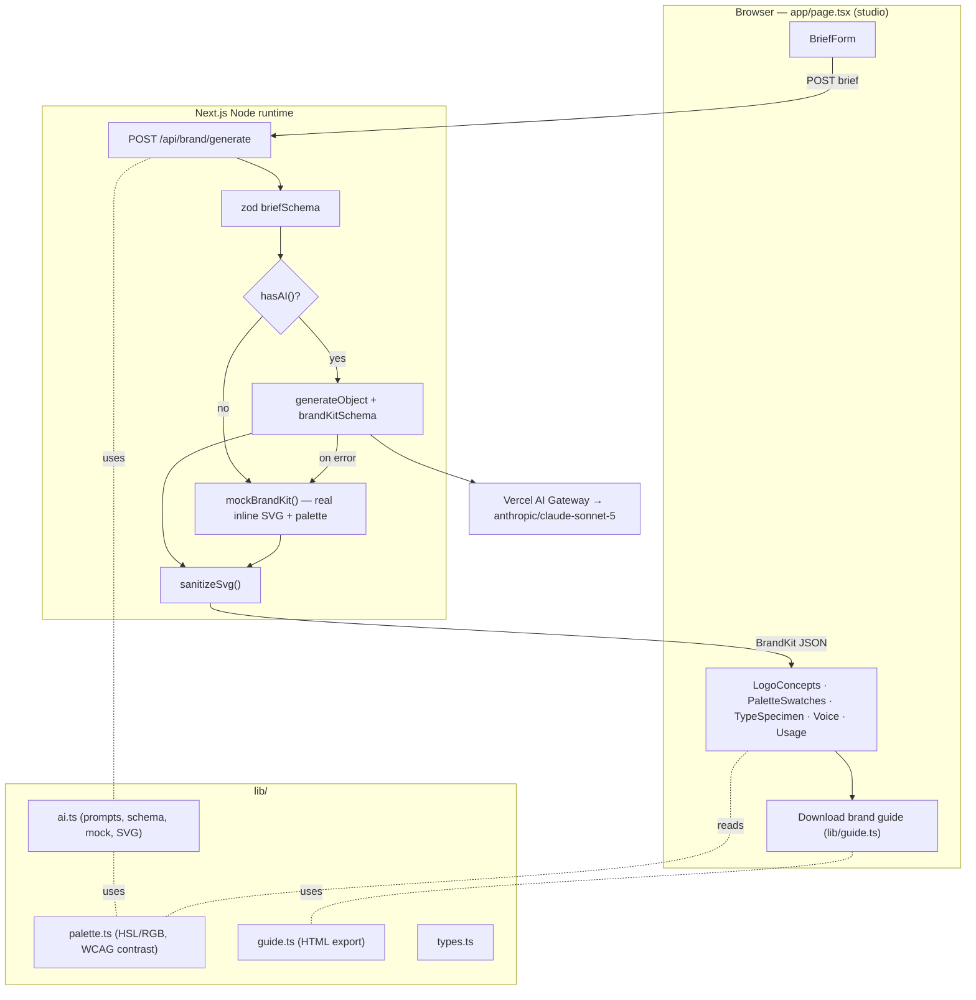

# Architecture — AI Logo & Brand Design Studio

## System diagram



## Data flow: brief → concepts → palette/type → brand kit → export

1. **Brief.** The user fills `BriefForm` (name, industry, values, style,
   optional audience/description). Submit posts JSON to
   `/api/brand/generate`.
2. **Validate.** The route parses the body with `briefSchema` (zod). Invalid
   input returns 422 with flattened errors.
3. **Generate.**
   - **Live:** `generateObject({ model: smart, schema: brandKitSchema, system,
     prompt, temperature: 0.8 })` returns concepts + palette + typography +
     voice + usage rules in one structured call.
   - **Mock:** `mockBrandKit(brief)` seeds a hue from a hash of the brief,
     builds a coherent palette (`lib/palette.ts`), selects a curated type
     pairing, and renders three parametric SVG logos referencing the palette.
4. **Sanitize.** Every SVG passes through `sanitizeSvg()` (scripts, handlers,
   remote refs stripped) before it is returned.
5. **Assemble.** The route builds a `BrandKit` (adds `mocked`, `latencyMs`,
   stable concept ids) and responds `{ kit }`.
6. **Render.** The studio renders logos (`dangerouslySetInnerHTML` on sanitized
   SVG) on the palette background, swatches with a WCAG audit, a type specimen,
   brand voice, and usage rules.
7. **Export.** `lib/guide.ts` builds a self-contained HTML brand guide (embedded
   SVGs + Google Fonts links); the client downloads it as a Blob.

## Request lifecycle

```
Client fetch → Node route (nodejs runtime, maxDuration 60s)
  → zod validation
    → hasAI() ? generateObject(AI Gateway) : mockBrandKit()
      → (AI error) → mockBrandKit()
    → sanitizeSvg() over concepts
  → 200 { kit } (or 400 / 422)
Client → setState(kit) → render sections → optional guide download
```

## Deployment topology

- **Platform:** Vercel. Static/SSR assets on the edge/CDN; the generate route
  runs as a Node.js Function (Fluid Compute).
- **Statelessness:** no database in v1; each request is self-contained. Adding
  auth/billing/history (roadmap) introduces Postgres + Stripe.
- **Model access:** all model traffic egresses through the Vercel AI Gateway.
- **Scaling:** functions scale horizontally; mock path absorbs demo/no-key load
  at zero model cost.

## Environment & config

| Variable | Required | Purpose |
| --- | --- | --- |
| `AI_GATEWAY_API_KEY` | for live mode | Routes model calls through the AI Gateway |
| `ANTHROPIC_API_KEY` | alt for local | Also satisfies `hasAI()` |
| `OPENAI_API_KEY` / `FAL_KEY` / `REPLICATE_API_TOKEN` | roadmap | Raster mockups |
| `GOOGLE_FONTS_API_KEY` | roadmap | Live font metadata |

Without any key the app runs in deterministic **mock mode** and still renders
real inline-SVG logos, a generated palette, typography, voice, and export — the
full flow is exercised end to end. Config precedence and safe fallback are
implemented in `lib/ai.ts` (`hasAI()`), and the route degrades to mock on any
model error so the studio never hard-fails a valid brief.
