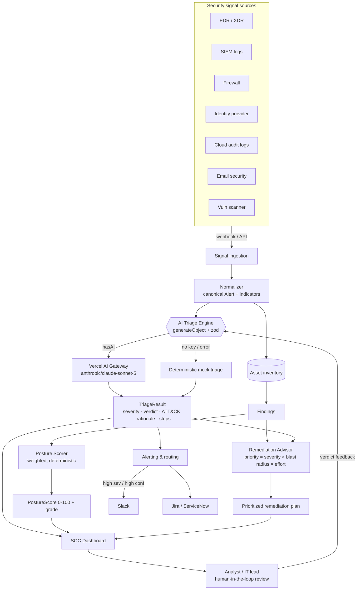
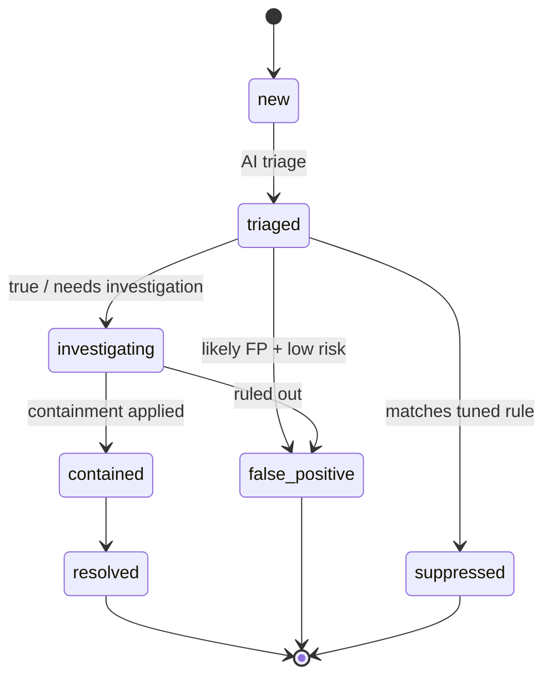

# Architecture — Managed AI Cybersecurity

> Strictly defensive / blue-team. The pipeline detects, triages, scores, and remediates. No
> offensive components exist anywhere in this design.

## System diagram

## Data flow

1. **Ingest.** Sources push alerts/events via webhook or are polled via API; analysts can also submit
   manually. In the scaffold, `POST /api/triage` accepts a raw alert and the dashboard replays a seed
   feed (`lib/mock-data.ts`).
2. **Normalize.** Heterogeneous vendor payloads are mapped to the canonical `Alert` shape; indicators
   (IP, user, host, process, hash, domain) are extracted and the alert is linked to an `Asset` whose
   business `criticality` informs downstream weighting.
3. **Triage (AI).** `POST /api/triage` calls `generateObject` with `triageSchema` through the AI
   Gateway under a defensive SOC-analyst system prompt, yielding a typed `TriageResult`. With no key
   (or on model error) `mockTriage` returns the identical shape — the alert is never dropped.
4. **Posture.** Findings (from scanners, config checks, triaged alerts) feed `computePosture`, a
   transparent weighted calculation → a 0–100 score, letter grade, per-category breakdown, and severity
   histogram, plus a trend delta vs. the previous evaluation.
5. **Remediate.** `buildRemediations` groups open findings by category and ranks them by severity ×
   blast radius × effort into a prioritized, plain-language plan; per-alert defensive steps come from
   the triage call.
6. **Alert & display.** High-severity/high-confidence results route to Slack/ticketing (M2); the SOC
   dashboard renders the posture gauge, KPIs, the triaged alert feed with color-coded severity + ATT&CK
   tags, and the remediation panel.
7. **Human-in-the-loop.** `requiresHumanReview` gates auto-closure; analyst verdicts feed back to tune
   triage precision per tenant (M6).

## Alert lifecycle

`new → triaged` is automatic. Transitions out of `triaged` respect `requiresHumanReview`:
high-severity or low-confidence alerts require an analyst before auto-closing. Every transition is
written to the immutable audit log.

## Request lifecycle (triage)

1. Client/connector `POST /api/triage` with a raw alert.
2. Route parses JSON, `zod`-validates (`400` invalid JSON, `422` validation error), normalizes to an
   `Alert`.
3. `hasAI()` → real `generateObject` call (temp 0.2, `triageSchema`); else `mockTriage`.
4. `toTriageResult` derives `isLikelyFalsePositive` and attaches `mocked` + `latencyMs`.
5. Returns `{ triage }`; model errors degrade to mock with an `x-fallback-reason` header.

## Deployment topology

- **Platform:** Vercel. Next.js 15 App Router; API routes on the **Node.js runtime (Fluid Compute)** so
  SIEM/EDR/ticketing SDKs (not edge-compatible) can run server-side.
- **Model access:** Vercel AI Gateway via `"provider/model"` strings — provider keys never touch the
  client; no provider SDK wired directly.
- **Ingestion scale (M1+):** connector webhooks → queue → batched triage workers to absorb bursts.
- **State (M1+):** Postgres (assets/alerts/findings/scores) + time-series store (posture trend) +
  object storage (reports). The scaffold is stateless with seed data.
- **Multi-tenancy (M3):** logical isolation with row-level scoping; MSP console spans tenants with RBAC.

## Environment & configuration

Configured via environment variables (see [`.env.example`](../.env.example)):

- `AI_GATEWAY_API_KEY` / `ANTHROPIC_API_KEY` — enable real AI triage; absent → deterministic mock.
- **SIEM:** `SIEM_API_URL`, `SIEM_API_TOKEN`; `SENTINEL_WORKSPACE_ID`, `SENTINEL_SHARED_KEY`.
- **EDR:** `CROWDSTRIKE_CLIENT_ID/SECRET`, `SENTINELONE_API_TOKEN`/`SENTINELONE_CONSOLE_URL`,
  `DEFENDER_*`.
- **Identity:** `OKTA_ORG_URL`, `OKTA_API_TOKEN`.
- **Routing:** `SLACK_WEBHOOK_URL`, `TICKETING_API_URL`, `TICKETING_API_TOKEN`.
- **Platform:** `APP_BASE_URL`.

No secrets are committed; local dev copies `.env.example` → `.env.local`. With **no** variables set the
product still runs end-to-end on mock triage + deterministic posture scoring.
